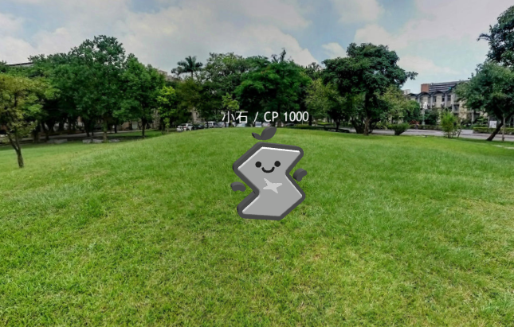

RockVR
======

COSCUP 2016 Lightning Talk, 投影片[在此](https://speakerdeck.com/rschiang/sitcon-go-with-three-dot-js)。

Pokémon Go-like interactive webpage. Built with Three.js, Cannon.js and several useful libraries.

License / 授權
==============

“X-ball”, “Rock” 3D models are independent creations based on SITCON logo and mascot, purposes other than testing should ask explicit permission before distributing the original or modified model with or without its companion code (“this repo.”)

The photosphere of [National Taiwan University Library](http://www.lib.ntu.edu.tw) backyard is licensed under [CC BY 3.0 TW](http://creativecommons.org/licenses/by/3.0/tw/) (Creative Commons Attribution 3.0 Taiwan License).

Source code released under [MIT License](LICENSE.md).
